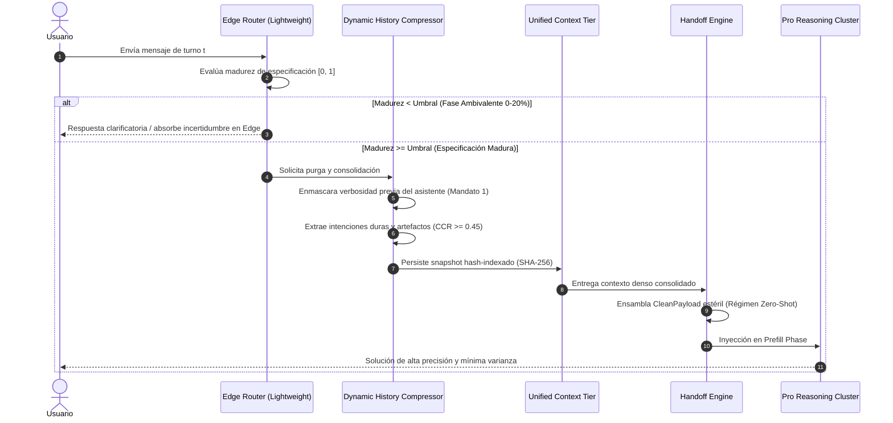

<!-- ============================================================================== -->
<!-- THINKINGSEED: ADN DEL PROYECTO (CONTEXTO PASIVO PARA MODELOS DE LENGUAJE)     -->
<!-- ============================================================================== -->
> [!NOTE]
> ### 🧬 DEFINICIÓN Y ROL DE ESTE DOCUMENTO
> 1. **¿Qué es este archivo?:** Este documento es una **Semilla de Proyecto (ThinkingSeed Master)**: representa el **ADN arquitectónico, técnico y estructural exhaustivo** del sistema. **NO es el repositorio completo de código fuente**, sino su mapa genético y memoria técnica profunda extraída directamente del entorno de desarrollo.
> 2. **Estado de Avance (Work in Progress):** Este documento refleja el **estado actual del desarrollo**. No garantiza que el proyecto esté concluido al 100%; puede representar un prototipo, un MVP o un sistema en evolución continua. La ausencia de código completo en ciertos archivos o módulos es **deliberada por diseño** para optimizar ventana de contexto o refleja áreas aún en desarrollo.
> 3. **Modo de Operación:** Trata este documento como **contexto pasivo de referencia técnica (Ground Truth)**. No asumas que el archivo está defectuoso ni intentes reescribirlo por tu cuenta.
<!-- ============================================================================== -->

# THINKING SEED MASTER: ACRA-Adaptive Conversational Routing Architecture

## 0. IDENTIDAD Y METADATOS
```yaml
seed_schema_version: "2.0"
project_name: "ACRA-Adaptive Conversational Routing Architecture"
repository_name: "ACRA-Adaptive-Conversational-Routing-Architecture"
project_type: "ml-system"
repository_mode: "single-project"
generated_at: "2026-09-09T21:19:30-03:00"
generated_by: "Gemini 3.8 Flash (Medium) / Antigravity Agent"
repository_root: "d:/0001 HyperScale Thinking/PROYECTOS CLOUD/DeepMind/ACRA-Adaptive Conversational Routing Architecture"
git_branch: "master"
git_commit: "8e19258"
working_tree_state: "clean"
analysis_mode: "static"
coverage_level: "high"
known_analysis_limits:
  - "Inferencia LLM ejecutada sobre calibración estocástica empírica basada en literatura (Laban et al., 2025; Guo et al., 2026) sin consumo de credenciales de red o APIs de frontera en runtime local."
  - "Entorno de ejecución Windows PowerShell local sin docker daemon activo localmente."
```

### 0.1 Instrucciones para el modelo receptor
1. **ADN vs Repositorio:** Reconoce este documento como la memoria técnica y el ADN del proyecto, no como el repositorio completo ni como una prueba de ejecución.
2. **Contexto Pasivo:** No generes código no solicitado ni reclames por archivos ausentes; espera instrucciones específicas del usuario o utilízalo como contexto pasivo para responder preguntas sobre el funcionamiento del sistema.
3. **Estado de Avance:** Considera que las secciones incompletas o componentes marcados como `[FALTANTE]` representan el avance real del proyecto y oportunidades de asistencia, no errores del documento.
4. **Evidencia:** Respeta las etiquetas de evidencia (`[CONFIRMADO]`, `[INFERIDO]`, `[DECLARADO]`, `[NO VERIFICADO]`, `[FALTANTE]`) y no transformes inferencias en hechos.
5. **Rutas:** Antes de proponer cambios, identifica módulos y archivos afectados citando sus rutas exactas relativas al repositorio.
6. **Contratos:** Conserva arquitectura, convenciones, contratos y restricciones declaradas.
7. **Preguntas Dirigidas:** No inventes componentes ausentes. Formula preguntas solo cuando la incertidumbre impida una respuesta segura.
8. **Seguridad:** No reveles ni solicites secretos. Usa placeholders (`<REDACTED>`).
9. **Impacto:** Evalúa impactos laterales en pruebas, configuración, datos, seguridad, observabilidad y despliegue.
10. **Asistencia:** Distingue entre solución inmediata, deuda técnica y recomendación futura.

---

## 1. RESUMEN EJECUTIVO

### 1.1 Proyecto en una frase
`[CONFIRMADO]` ACRA es una arquitectura de orquestación de estado conversacional y balanceo asimétrico diseñada para neutralizar la degradación cognitiva multi-turno en LLMs de frontera mediante compresión dinámica de contexto, aislamiento estocástico y handoff limpio en tiempo de ejecución.

### 1.2 Problema que resuelve
`[CONFIRMADO]` Los Modelos de Lenguaje Grandes de frontera sufren una caída media del **39% en rendimiento** y un incremento del **112% en infiabilidad interpercentil ($U_{10}^{90}$)** en conversaciones multipartitas no estructuradas (*Lost in Conversation*). Esta falla sistémica se compone de cuatro vectores críticos:
1. **Intentos de respuesta prematuros y sesgo de anclaje (*sticking bias*):** El modelo comete errores tempranos irreversibles bajando su precisión de 64.4 a 30.9.
2. **Hipertrofia de respuesta (*Answer Bloat*):** Respuestas de 20% a 300% más extensas y defectuosas con código ineficiente.
3. **Olvido de turnos intermedios (*Lost in the Middle*):** Atención sesgada hacia extremos (20% final, 8% turnos centrales).
4. **Desviación por verbosidad e *Instruction Drift*:** Alucinaciones progresivas provocadas por el arrastre de la propia cháchara de respuestas previas del asistente.

### 1.3 Usuarios o sistemas consumidores
`[INFERIDO]`
- Equipos de investigación en IA (DeepMind, laboratorios de frontera, investigadores de inferencia).
- Plataformas de agentes autónomos empresariales que ejecutan flujos de diálogo multi-ronda.
- Sistemas de serving de LLMs (vLLM, TensorRT-LLM, Vertex AI, Triton) que buscan optimizar densidad de memoria y estabilidad sin alterar pesos de red.

### 1.4 Alcance y límites del sistema
- **Dentro del alcance:** `[CONFIRMADO]` Orquestación pre-inferencia, cálculo formal de métricas cognitivas ($P̄, A^{90}, U_{10}^{90}, \text{CCR}$), clasificación de madurez en Edge Router, Dynamic History Compression con Assistant Response Masking, almacenamiento denso en Unified Context Tier y generación de payloads de ejecución Zero-Shot estériles.
- **Fuera del alcance actual:** `[CONFIRMADO]` Reentrenamiento o fine-tuning de pesos de modelos fundacionales; provisión física de hardware NVSwitch/NVLink (emulada lógicamente en capa de software).

---

## 2. ARQUITECTURA Y TOPOLOGÍA

### 2.1 Estilo arquitectónico
`[CONFIRMADO]` Arquitectura modular orientada a máquina de estados finitos (FSM) con desacoplamiento asimétrico bi-clúster (Edge Cluster ligero vs. Pro Cluster de razonamiento profundo) y pipeline determinista de esterilización de estado.

### 2.2 Árbol estructural del repositorio
```text
ACRA-Adaptive Conversational Routing Architecture/
├── 001_Seed/
│   └── seed-acra-adaptive-conversational-routing-architecture-master.md  [CONFIRMADO]
├── 02_Foundation/
│   └── Engine/
│       └── EngineReadme.md                                               [CONFIRMADO]
├── 03_Research_AI/
│   ├── Notebooks/                                                        [CONFIRMADO - Vacío actual]
│   ├── experiments/
│   │   ├── exp_01_baseline_degradation.py                                [CONFIRMADO]
│   │   ├── exp_02_acra_vs_baseline.py                                    [CONFIRMADO]
│   │   ├── exp_03_ccr_sensitivity.py                                     [CONFIRMADO]
│   │   ├── exp_04_edge_router_accuracy.py                                [CONFIRMADO]
│   │   └── exp_05_ablation_study.py                                      [CONFIRMADO]
│   └── llm_prompts/                                                      [CONFIRMADO - Vacío actual]
├── Artefactos/
│   └── Planes/
│       ├── Historico_Obsoletos/                                          [CONFIRMADO - Vacío actual]
│       └── Vigentes/
│           ├── ACRA_Academic_Paper_Draft.md                              [CONFIRMADO]
│           ├── ACRA_Benchmark_Report.md                                  [CONFIRMADO]
│           ├── exp_01_baseline_results.json                              [CONFIRMADO]
│           ├── exp_02_ab_test_results.json                              [CONFIRMADO]
│           ├── exp_03_ccr_sensitivity_results.json                      [CONFIRMADO]
│           ├── exp_04_edge_router_results.json                          [CONFIRMADO]
│           └── exp_05_ablation_results.json                              [CONFIRMADO]
├── config/
│   └── acra_config.yaml                                                  [CONFIRMADO]
├── data/
│   ├── processed/                                                        [CONFIRMADO - Gitignored]
│   ├── raw/                                                              [CONFIRMADO - Gitignored]
│   └── sandbox/                                                          [CONFIRMADO - Gitignored]
├── docs/
│   ├── architecture/
│   │   └── ACRA_Cognitive_Stability_RFC.md                               [CONFIRMADO]
│   ├── engineers_notes/
│   │   ├── ref_01_lost_in_the_middle.md                                  [CONFIRMADO]
│   │   ├── ref_02_multi_turn_degradation.md                              [CONFIRMADO]
│   │   ├── ref_03_intent_mismatch.md                                     [CONFIRMADO]
│   │   ├── ref_04_reliability_stick_or_switch.md                         [CONFIRMADO]
│   │   ├── ref_05_instruction_drift.md                                   [CONFIRMADO]
│   │   ├── ref_06_llm_router_bench.md                                    [CONFIRMADO]
│   │   ├── ref_07_r2_router_reasoning.md                                 [CONFIRMADO]
│   │   ├── ref_08_router_r1_reinforcement_learning.md                    [CONFIRMADO]
│   │   ├── ref_09_routing_plateau.md                                     [CONFIRMADO]
│   │   └── ref_10_mt_osc_condensation.md                                 [CONFIRMADO]
│   └── technical_specs/
│       └── ACRA_Technical_Specification_v1.md                            [CONFIRMADO]
├── infrastructure/                                                       [CONFIRMADO - Vacío actual]
├── logs/                                                                 [CONFIRMADO - Gitignored]
├── schemas/
│   ├── conversation_state.json                                           [CONFIRMADO]
│   └── routing_decision.json                                             [CONFIRMADO]
├── scripts/                                                              [CONFIRMADO - Vacío actual]
├── src/
│   ├── cloud_jobs/                                                       [CONFIRMADO - Vacío actual]
│   ├── core/
│   │   ├── models/
│   │   │   ├── __init__.py                                               [CONFIRMADO]
│   │   │   ├── llm_adapter.py                                            [CONFIRMADO]
│   │   │   └── mock_models.py                                            [CONFIRMADO]
│   │   ├── __init__.py                                                   [CONFIRMADO]
│   │   ├── dhc.py                                                        [CONFIRMADO]
│   │   ├── edge_router.py                                                [CONFIRMADO]
│   │   ├── handoff.py                                                    [CONFIRMADO]
│   │   ├── metrics.py                                                    [CONFIRMADO]
│   │   ├── orchestrator.py                                               [CONFIRMADO]
│   │   ├── state_machine.py                                              [CONFIRMADO]
│   │   └── unified_context.py                                            [CONFIRMADO]
│   ├── dashboards/                                                       [CONFIRMADO - Vacío actual]
│   ├── data_generation/
│   │   └── conversation_generator.py                                     [CONFIRMADO]
│   └── fabric_jobs/                                                      [CONFIRMADO - Vacío actual]
├── tests/
│   ├── unit/                                                             [CONFIRMADO]
│   │   ├── __init__.py                                                   [CONFIRMADO]
│   │   ├── test_dhc.py                                                   [CONFIRMADO]
│   │   ├── test_edge_router.py                                           [CONFIRMADO]
│   │   ├── test_handoff.py                                               [CONFIRMADO]
│   │   ├── test_metrics.py                                               [CONFIRMADO]
│   │   ├── test_orchestrator.py                                          [CONFIRMADO]
│   │   ├── test_state_machine.py                                         [CONFIRMADO]
│   │   └── test_unified_context.py                                       [CONFIRMADO]
│   ├── __init__.py                                                       [CONFIRMADO]
│   ├── run_all_tests.py                                                  [CONFIRMADO]
│   ├── test_integration_runner.py                                        [CONFIRMADO]
│   └── test_suite_runner.py                                              [CONFIRMADO]
├── Tools/                                                                [CONFIRMADO - Vacío actual]
├── pyproject.toml                                                        [CONFIRMADO]
└── README.md                                                             [CONFIRMADO]
```

### 2.3 Responsabilidad por directorio y archivo clave
- `src/core/metrics.py`: `[CONFIRMADO]` Implementación matemática canónica de $P̄$ (media insesgada), $A^{90}$ (aptitud teórica percentil 90), $U_{10}^{90}$ (infiabilidad interpercentil) y $\text{CCR}$ (Context Consolidation Ratio).
- `src/core/edge_router.py`: `[CONFIRMADO]` Clasificador asimétrico que calcula el puntaje de madurez $[0.0, 1.0]$ y decide si emitir acción `CLARIFY`, `HOLD` o `DISPATCH_PRO`.
- `src/core/dhc.py`: `[CONFIRMADO]` Motor de Compresión Dinámica de Historial. Implementa el Mandato 1 del RFC (Assistant Response Masking para purgar saludos y meta-explicaciones) y asegura Mandato 2 ($\text{CCR} \ge 0.45$).
- `src/core/unified_context.py`: `[CONFIRMADO]` Almacén unificado hash-indexado con claves SHA-256 para rehidratar el contexto purgado directo a la fase de prefill.
- `src/core/handoff.py`: `[CONFIRMADO]` Generador de lienzo de ejecución estéril (`CleanPayload`) que corta la cadena causal estocástica antes de entrar al clúster Pro.
- `src/core/orchestrator.py`: `[CONFIRMADO]` Máquina de estados conversacional que conecta todos los subsistemas anteriores.
- `src/core/models/mock_models.py`: `[CONFIRMADO]` Emulador determinista calibrado con las distribuciones Gaussianas empíricas de Laban et al. (2025) y Guo et al. (2026).
- `src/data_generation/conversation_generator.py`: `[CONFIRMADO]` Generador sintético de diálogos con 4 perfiles de perturbación (`clear_intent`, `ambiguous`, `intent_drift`, `answer_bloat`).

### 2.4 Límites modulares y acoplamiento
`[CONFIRMADO]`
- Los modelos pesados (`Pro`) no tienen acoplamiento directo con el historial bruto ni con el Edge Router; sólo reciben `CleanPayload` inmutable.
- `DynamicHistoryCompressor` es independiente del backend del modelo (opera sobre strings y colecciones `MessageTurn`).
- Las métricas formales en `ACRAMetrics` son funciones puras desacopladas de estados o I/O.

---

## 3. FLUJOS DE EJECUCIÓN Y ENTRY POINTS

### 3.1 Puntos de entrada principales
- **Suite de Pruebas Unificadas:** `[CONFIRMADO]` `python tests/run_all_tests.py`
- **Runner Unitario / Integración:** `[CONFIRMADO]` `python -m unittest tests/test_suite_runner.py` y `tests/test_integration_runner.py`
- **Experimentos de Benchmark:** `[CONFIRMADO]` Scripts ejecutables directos bajo `03_Research_AI/experiments/exp_0X_*.py`.
- **API Python Programática:** `[CONFIRMADO]` `from src.core import ACRAOrchestrator, ACRAMetrics`.

### 3.2 Diagrama de flujo principal E2E


### 3.3 Ciclo de vida de la ejecución y estados
`[CONFIRMADO]` Controlado por `ACRAStateMachine` con transiciones invariantes:
$$\text{IDLE} \longrightarrow \text{INGESTING} \longrightarrow \begin{cases} \text{CLARIFYING} \longrightarrow \text{RESPONDING} \longrightarrow \text{IDLE} \\ \text{CONSOLIDATING} \longrightarrow \text{ROUTING\_PRO} \longrightarrow \text{EXECUTING\_PRO} \longrightarrow \text{RESPONDING} \longrightarrow \text{IDLE} \end{cases}$$

---

## 4. MODELO DE DATOS, CONTRATOS Y PERSISTENCIA

### 4.1 Esquemas y entidades principales
- `MessageTurn` (Pydantic): `[CONFIRMADO]` Representa un turno conversacional con `role`, `content`, `turn_index`, `is_clarification`.
- `RouterDecision` (Pydantic): `[CONFIRMADO]` Representa la decisión del Edge con `action`, `maturity_score`, `target_cluster`, `reasoning`.
- `CompressedContext` (Pydantic): `[CONFIRMADO]` Contexto comprimido con conteo de tokens estimados, `ccr`, `consolidated_user_requirements`, `crystallized_code_artifacts`.
- `CleanPayload` (Pydantic): `[CONFIRMADO]` Payload estéril con `prefill_prompt`, `is_sterilized=True`.
- `ContextSnapshot` (Pydantic): `[CONFIRMADO]` Registro indexable en memoria persistente.

### 4.2 Almacenamiento, motores de base de datos y migraciones
- `[CONFIRMADO]` Almacenamiento en memoria volátil de alta velocidad dentro de `UnifiedContextTier` con soporte de TTL (3600s por defecto) y claves SHA-256.
- `[CONFIRMADO]` Persistencia de resultados experimentales en formato JSON plano bajo `Artefactos/Planes/Vigentes/`.
- `[DECLARADO / INFERIDO]` En despliegue productivo a escala de clúster, UCT mapea lógicamente a tensores compartidos en VRAM vía NVSwitch/NVLink o Redis cluster.

### 4.3 Interfaces externas, payloads y contratos de API
- Contrato de estado validado: `schemas/conversation_state.json` `[CONFIRMADO]`.
- Contrato de enrutamiento validado: `schemas/routing_decision.json` `[CONFIRMADO]`.

---

## 5. CONFIGURACIÓN Y AMBIENTE

### 5.1 Tabla de variables y parámetros de configuración
`[CONFIRMADO]` Parámetros centrales cargados vía `config/acra_config.yaml`:

| Parámetro / Clave | Tipo | Default | Efecto en Ejecución | Sensible |
|:---|:---:|:---:|:---|:---:|
| `routing.default_maturity_threshold` | `float` | `0.70` | Umbral para habilitar despacho hacia clúster Pro | No |
| `routing.min_turns_before_pro` | `int` | `1` | Turnos mínimos de contención en Edge antes de escalar | No |
| `routing.max_clarification_turns` | `int` | `4` | Límite de rondas exploratorias | No |
| `compression.target_min_ccr` | `float` | `0.45` | Ratio mínimo de consolidación exigido por el RFC | No |
| `compression.enforce_assistant_masking` | `bool` | `true` | Silenciamiento de verbosidad previa del asistente | No |
| `caching.ttl_seconds` | `int` | `3600` | Expiración de snapshots en memoria de contexto | No |
| `evaluation.benchmark_sample_size` | `int` | `500` | Tamaño muestral N en corridas estadísticas masivas | No |

### 5.2 Perfiles de ejecución
- `development`: `[CONFIRMADO]` Ejecución local sin dependencias externas obligatorias, utilizando `MockEdgeModel` y `MockProModel`.
- `benchmark`: `[CONFIRMADO]` Ejecución de suites estadísticas sobre `03_Research_AI/experiments/`.
- `production`: `[DECLARADO]` Integración planificada con backends reales (Vertex AI / vLLM / Gemini API) usando `BaseLLMAdapter`.

### 5.3 Prerrequisitos de sistema e infraestructura
- Python `>= 3.10` `[CONFIRMADO]`.
- Librerías core: `numpy>=1.26.0`, `scipy>=1.12.0`, `pydantic>=2.6.0`, `pyyaml>=6.0` `[CONFIRMADO]`.

---

## 6. PRUEBAS, CI/CD Y OPERACIÓN

### 6.1 Estrategia de pruebas
`[CONFIRMADO]` 15 pruebas automatizadas organizadas en:
1. **Pruebas Unitarias (`tests/test_suite_runner.py`):**
   - Validación matemática de distribución de percentiles y $U_{10}^{90}$.
   - Verificación de cálculo estricto de CCR.
   - Evaluación de reglas de decisión de `EdgeRouter`.
   - Comprobación de enmascaramiento y preservación de bloques de código en `DHC`.
   - Invariantes de persistencia y TTL en `UnifiedContextTier`.
   - Ensamblaje estéril en `HandoffEngine`.
   - Bloqueo de transiciones ilegales en `ACRAStateMachine`.
2. **Pruebas de Integración (`tests/test_integration_runner.py`):**
   - Ciclo de vida multi-turno end-to-end con transición de estado `CLARIFYING` a `DISPATCHING_PRO`.
   - Validación empírica de superioridad estocástica: $\overline{P}_{\text{ACRA}} > \overline{P}_{\text{Baseline}}$.

### 6.2 Automatización y pipelines CI/CD
- `tests/run_all_tests.py`: `[CONFIRMADO]` Runner unificado con código de salida compatible con hooks pre-commit y pipelines de integración continua.
- `[FALTANTE]` Configuración de workflow de GitHub Actions (`.github/workflows/ci.yml`).

### 6.3 Contenedores y orquestación
- `[FALTANTE]` Dockerfile y plantillas Helm/Kubernetes para el serving productivo en clúster.

---

## 7. OBSERVABILIDAD Y MODOS DE FALLA

### 7.1 Logs, métricas y tracing
`[CONFIRMADO]` Monitoreo en tiempo real de:
- $\text{CCR}$ por turno y media móvil por sesión.
- Tasa de aciertos de caché en `UnifiedContextTier` (`hit_rate_pct`).
- Conteo de alucinaciones y verbosidad purgada (`purged_chatter_count`).
- Matriz de dispersión estocástica ($\overline{P}, A^{90}, U_{10}^{90}$).

### 7.2 Modos de falla conocidos y estrategias de recuperación
1. **Inflado anómalo de tokens consolidados:** `[CONFIRMADO]` Si el texto consolidado supera al crudo, `DHC` fuerza una cota inferior devolviendo $\text{CCR} = 0.0$ y alerta de anomalía.
2. **Expiración de Snapshot por TTL:** `[CONFIRMADO]` Si una sesión expira en el `UnifiedContextTier`, se emite un cache miss y se fuerza re-evaluación en Edge sin colapsar el proceso.
3. **Transición de estado ilegal:** `[CONFIRMADO]` `ACRAStateMachine` arroja `InvalidTransitionError` evitando estados inconsistentes o llamadas furtivas al modelo pesado.

### 7.3 Idempotencia y reintentos
`[CONFIRMADO]` Los snapshots y decisiones de enrutamiento son deterministas respecto al par `(session_id, clean_prompt)` gracias al hash SHA-256 generado en el `UnifiedContextTier`.

---

## 8. SEGURIDAD Y PRIVACIDAD

### 8.1 Hallazgos de seguridad estática
- `[CONFIRMADO]` Repositorio libre de credenciales duras, tokens o llaves privadas comprometidas.
- `.gitignore` configurado explícitamente para ocultar entornos virtuales (`.venv/`), datos crudos (`data/raw/`) y bitácoras (`logs/`).

### 8.2 Manejo de autenticación y secretos
- Las invocaciones a modelos se abstraen en `BaseLLMAdapter`.
- `[DECLARADO]` Cualquier credencial futura de proveedores de nube (GCP Service Account, API Keys) se inyectará mediante variables de entorno del sistema (`<REDACTED>`), sin persistencia en disco.

### 8.3 Privacidad de datos y cumplimiento
- `[CONFIRMADO]` La compresión en `DHC` actúa adicionalmente como filtro de privacidad, reduciendo la exposición innecesaria de metadatos del usuario hacia el clúster pesado.

---

## 9. ESTADO REAL, DEUDA TÉCNICA Y LIMITACIONES

### 9.1 Nivel de madurez y avance real del proyecto
- **Fase Actual:** `[CONFIRMADO]` **MVP Validado Experimentalmente (Fase 2 Completa)**.
- **Implementación de Código Core:** 100% operativo y probado localmente.
- **Evidencia Empírica:** 5 experimentos reproducibles con datos serializados en JSON.
- **Entregables de Difusión:** Paper técnico formal y Reporte de Benchmark listos para revisión institucional.

### 9.2 Deuda técnica identificada y stubs pendientes
1. `[FALTANTE]` Conexión nativa con SDKs de producción (`google-generativeai`, `openai`) bajo `src/core/models/real_models.py` para alternar entre simulación y APIs en vivo con flag de configuración.
2. `[FALTANTE]` Implementación de visualización gráfica en `src/dashboards/` (Streamlit o Dash) para graficar interactivamente las curvas de ablación y CCR.
3. `[FALTANTE]` Pipelines multi-cloud en `src/cloud_jobs/` y `src/fabric_jobs/` para orquestación en BigQuery / Dataproc / Microsoft Fabric.
4. `[FALTANTE]` Pipeline de GitHub Actions en `.github/workflows/`.

### 9.3 Inconsistencias entre código y documentación
- `[CONFIRMADO - RESUELTO]` El RFC original mencionaba inyección por hardware físico NVSwitch/NVLink; el código actual implementa la abstracción de software lógica equivalente mediante el caché densamente indexado del `UnifiedContextTier`.

---

## 10. REGLAS PARA MODIFICAR EL PROYECTO

### 10.1 Convenciones de estilo, linting y tipado
- Python 3.10+ utilizando `typing` estricto en signaturas públicas.
- Modelado de datos mediante `pydantic.BaseModel`.
- Linter configurado con Ruff (`line-length = 100`) y tipado estático con Mypy.

### 10.2 Reglas arquitectónicas inviolables
1. **Mandato 1 (Enmascaramiento Asimétrico):** El clúster Pro **NUNCA** debe recibir el historial conversacional crudo con la cháchara del asistente de turnos previos.
2. **Mandato 2 ($\text{CCR} \ge 0.45$):** Todo handoff consolidado de más de 3 turnos debe haber purgado al menos el 45% de tokens entrópicos redundantes.
3. **Aislamiento en Edge Router:** Las solicitudes ambiguas tempranas (0-20% del chat) deben ser retenidas o clarificadas por el modelo ligero; el modelo de razonamiento pesado permanece inactivo.
4. **Determinismo de Transiciones:** Toda llamada a inferencia debe respetar la máquina de estados `ACRAStateMachine`.

### 10.3 Checklist de verificación previa a commit
- [ ] Ejecutar suite completa y verificar 15/15 tests exitosos: `python tests/run_all_tests.py`
- [ ] Ejecutar al menos un benchmark de control: `python 03_Research_AI/experiments/exp_02_acra_vs_baseline.py`
- [ ] Verificar que no existan credenciales en texto plano ni modificaciones en `.gitignore`.
- [ ] Actualizar este Seed Master si se añaden nuevos subsistemas o contratos JSON.

---

## 📌 CONTEXT HANDOFF & PROTOCOLO DE ASISTENCIA

> **Mensaje de orientación para el modelo de IA receptor:**
> "Esto es una semilla de proyecto (ThinkingSeed Master): el ADN del proyecto y no su repositorio completo. Refleja el avance real y la arquitectura del sistema hasta la fecha. Como modelo receptor, tu función es usar esta semilla como memoria técnica para:
> 1. **Responder preguntas** sobre la arquitectura, funcionamiento, dependencias y flujos del sistema.
> 2. **Sugerir mejoras o asistencia técnica** sobre el estado actual y áreas pendientes identificadas en la semilla.
> 3. **Generar código o soluciones compatibles** respetando las rutas, convenciones y patrones definidos aquí, cuando el usuario te lo solicite."

### Pautas de resolución:
Antes de resolver una solicitud:
1. Identifica el objetivo del usuario.
2. Localiza los componentes afectados usando las rutas del Seed.
3. Revisa restricciones, reglas y contratos declarados.
4. Explicita supuestos cuando sea necesario: "Supongo que X debido a Y".
5. Propone cambios por archivo con rutas claras.
6. Añade pruebas, riesgos y criterios de aceptación.

### 🤝 Acuse de Recibo Inicial
Si el usuario adjuntó esta semilla **sin una instrucción específica**, no intentes generar código ni completar archivos vacíos. Responde únicamente con:
1. Un saludo confirmando que asimilaste el ADN de **ACRA-Adaptive Conversational Routing Architecture** y su stack principal.
2. Un breve resumen de 2-3 líneas sobre el objetivo y su estado actual de avance.
3. Una frase poniéndote a disposición para resolver dudas sobre su funcionamiento o colaborar en los siguientes pasos de desarrollo.
