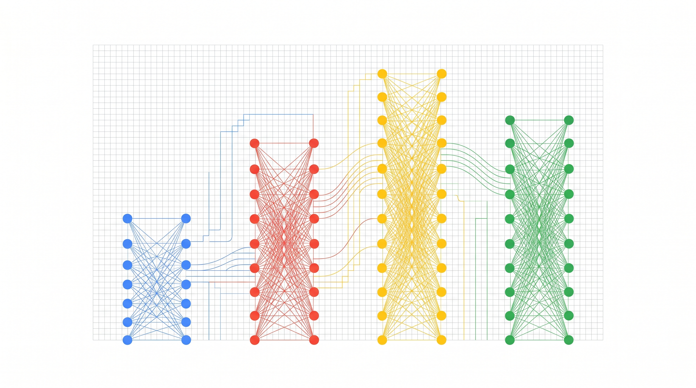
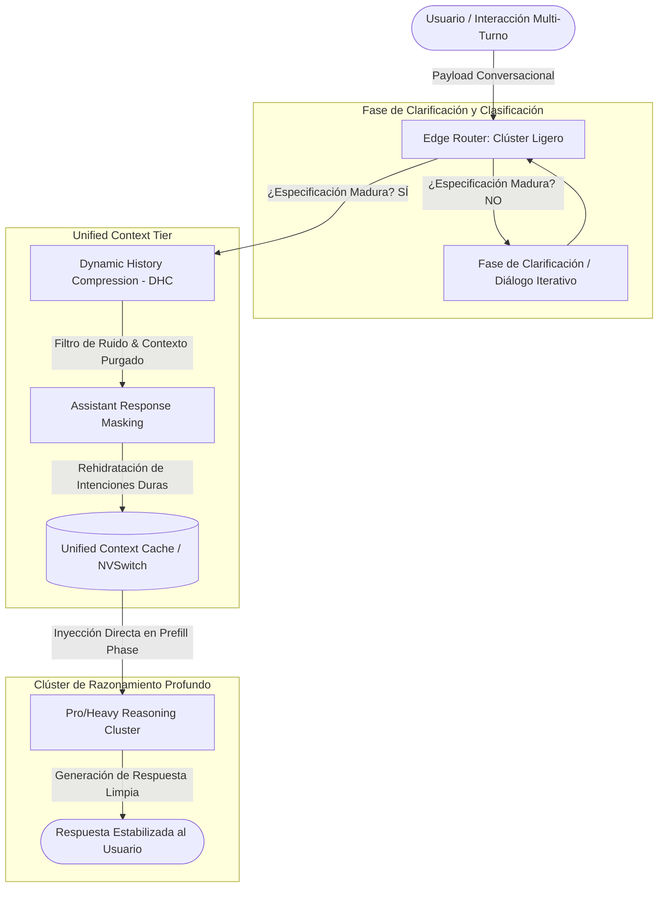

# ACRA: Adaptive Conversational Routing Architecture
## Orquestador de Estabilidad Cognitiva y Confiabilidad Multi-Turno

[](https://github.com/deepmind/acra)
[](LICENSE)
[](https://www.python.org/)
[](https://www.nvidia.com/)

**ACRA (Adaptive Conversational Routing Architecture)** es una arquitectura de grado industrial diseñada originalmente para maximizar la eficiencia de infraestructura y la densidad de VRAM mediante el enrutamiento dinámico entre clústeres ligeros y pesados. Sin embargo, bajo los estándares del presente **RFC de Estabilidad Cognitiva**, ACRA evoluciona para convertirse en el primer orquestador de estado conversacional diseñado específicamente para neutralizar el colapso cognitivo (*Lost in Conversation*) en interacciones multi-turno multipartitas de Modelos de Lenguaje Grandes (LLMs).

---

## Arquitectura del Sistema: Flujo de Enrutamiento Adaptativo



---

## Triple Perspectiva Arquitectónica

### 1. Perspectiva Matemática: Rigor, Algoritmia e Integridad

El colapso sistémico de los LLMs de frontera en interacciones multi-turno se formaliza analizando su comportamiento sobre un conjunto de simulaciones conversacionales $S=\{S_i\}_{i=1}^{N}$. Descomponemos el rendimiento del modelo en tres métricas fundamentales:

* **Rendimiento Promedio ($\overline{P}$):** La media insesgada de éxito en la tarea.
  $$\overline{P}=\frac{1}{N}\sum_{i=1}^{N}S_i$$
* **Aptitud ($A^{90}$):** El límite superior teórico del modelo en escenarios óptimos (percentil 90).
  $$A^{90}=\text{percentile}_{90}(S)$$
* **Infiabilidad ($U_{10}^{90}$):** La brecha estocástica entre el mejor y el peor caso de generación teórica (rango interpercentil).
  $$U_{10}^{90}=\text{percentile}_{90}(S)-\text{percentile}_{10}(S)$$

#### Análisis de Degradación Multi-Turno
* **Caída Generativa:** Los modelos experimentan una caída promedio del **39%** en el rendimiento al pasar de instrucciones monoturno a flujos multi-turno.
* **Preservación de Capacidad:** La Aptitud ($A^{90}$) disminuye apenas un **16%**, lo que demuestra que el modelo subyacente mantiene la competencia técnica.
* **Explosión de Infiabilidad:** La Infiabilidad ($U_{10}^{90}$) se incrementa en un **112%** debido al efecto de errores en cascada (desviación de tokens tempranos en el proceso de decisión de Markov).

#### KPI de Estabilidad: Context Consolidation Ratio (CCR)
Para monitorizar la salud cognitiva del clúster en tiempo real, ACRA introduce el **CCR**:
$$\text{CCR} = \frac{\text{Tokens de Contexto Purgados}}{\text{Tokens Totales en el Historial Conversacional}} \times 100$$
* **Mandato de Producción:** El sistema debe mantener un **CCR > 45%** en conversaciones de más de 3 turnos, asegurando la minimización del *Answer Bloat*.

---

### 2. Perspectiva Lógica: Topología, Eficiencia y Estructura

La topología de ACRA desacopla el estado conversacional de los bucles de generación estocástica mediante los siguientes mecanismos:

* **Edge Router & Aislamiento Temprano:** Implementa un clúster ligero para la fase de clarificación inicial (0-20% del flujo). El clúster Pro de razonamiento profundo permanece inactivo hasta que la especificación del requerimiento es óptima.
* **Unified Context Tier & Caching:** Los contextos purgados y consolidados se inyectan directamente como tensores densos en el clúster de destino utilizando tecnologías de interconexión física de baja latencia como **NVSwitch** y **NVLink**, optimizando drásticamente la *Prefill Phase*.
* **Compresión Dinámica de Historial (DHC):** Elimina el texto especulativo, explicaciones redundantes y código basura generados en turnos anteriores en el momento de la transición de clústeres.
* **Enmascaramiento Asimétrico del Asistente (Assistant Response Masking):** Descarta sistemáticamente la verbosidad explicativa generada por el LLM en turnos previos, rehidratando únicamente las directivas duras y los bloques funcionales validados en la base de conocimientos.

---

### 3. Perspectiva Creativa: Innovación y Diseño de Información

* **Corte de la Cascada de Markov:** Al obligar a cada invocación del clúster Pro a operar sobre un lienzo cognitivamente estéril (equivalente a un entorno Zero-Shot limpio), ACRA interrumpe la progresión matemática de las alucinaciones por acumulación de tokens estocásticos.
* **Capa de Traducción de Negocio (SLA Guardrail):** Actúa como un rompecircuitos inteligente. Si la infiabilidad acumulada en el buffer conversacional supera los umbrales de tolerancia del negocio, el sistema re-enruta el payload de forma asíncrona hacia un bucle de refinamiento de prompts y alertas visuales estructuradas para el equipo de SRE.
* **Diseño de Observabilidad Cognitiva:** Mapeo y logging estructurado que visualiza en tiempo real la dispersión de varianza en los clústeres, la entropía del prompt y la eficiencia del CCR a través de dashboards interactivos.

---

## 📂 Estructura de Capas de Datos y Lakehouse

ACRA organiza los flujos e interacciones en una estructura Lakehouse de tres capas de almacenamiento optimizado (Delta Parquet con compresión V-Order / Z-Order):

```
┌───────────────────────────────────────────────────────────────────────────┐
│ 🪙 BRONZE: Captura de Transacciones y Logs Conversacionales Raw (Raw JSON) │
└─────────────────────────────────────┬─────────────────────────────────────┘
                                      │ (Limpieza, Tokenización y Parsing)
                                      ▼
┌───────────────────────────────────────────────────────────────────────────┐
│ 🥈 SILVER: Telemetría Estructurada, Métricas de Desempeño y Entropía      │
└─────────────────────────────────────┬─────────────────────────────────────┘
                                      │ (Agregaciones y Cálculo de CCR)
                                      ▼
┌───────────────────────────────────────────────────────────────────────────┐
│ 🥇 GOLD: Reportes de Salud Cognitiva, Dashboards de SLA e Inferencia      │
└───────────────────────────────────────────────────────────────────────────┘
```

---

## 🚀 Despliegue e Instalación Rápida

### Requisitos Previos
* Python 3.10 o superior
* CUDA Toolkit 12.2+ (para soporte nativo de aceleración por GPU)
* Acceso a infraestructura NVLink (Recomendado para entornos de producción)

### Instalación Local
1. Clona el repositorio:
   ```bash
   git clone https://github.com/deepmind/acra.git
   cd acra
   ```
2. Instala las dependencias y el paquete en modo edición:
   ```bash
   pip install -e .
   ```
3. Ejecuta los tests unitarios para verificar la inicialización de los clústeres:
   ```bash
   pytest tests/
   ```

### Despliegue de Producción (Fabric / Kubernetes)
Para desplegar la topología de ruteo dinámico con soporte para el *Unified Context Tier*:
```bash
python scripts/deploy_routing_mesh.py --config config/production_mesh.json --enable-nvswitch
```

---

## 📄 Licencia

Este proyecto está bajo la Licencia Apache 2.0. Consulte el archivo [LICENSE](LICENSE) para obtener más detalles.
