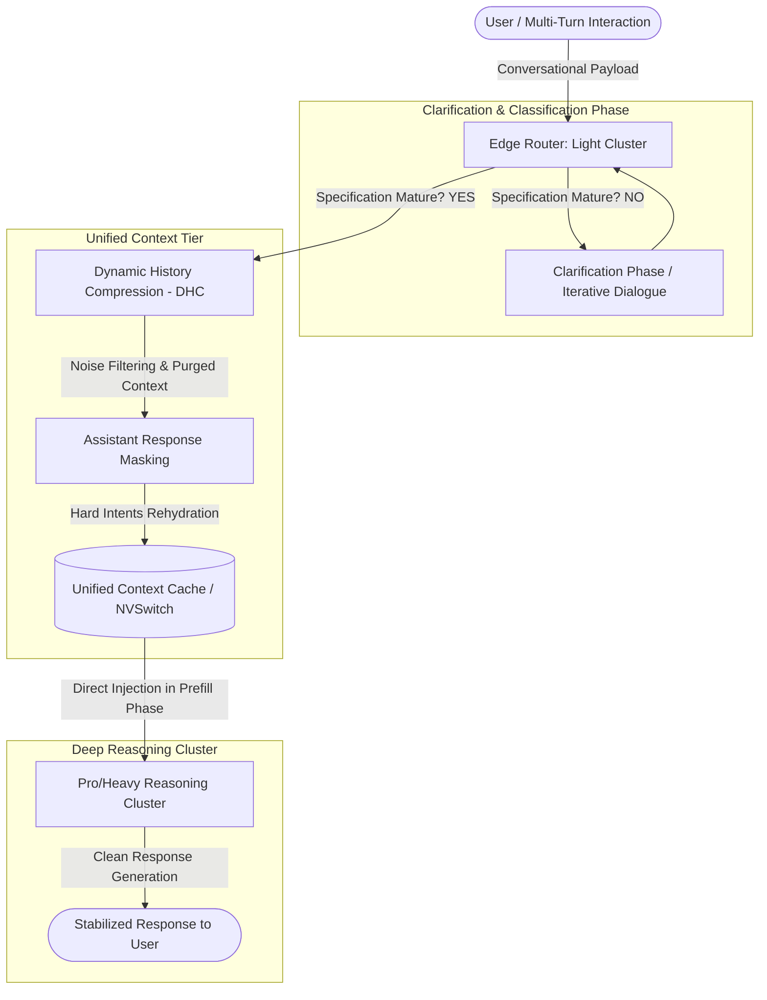

# 🧠 ACRA: Adaptive Conversational Routing Architecture
## Cognitive Stability & Multi-Turn Reliability Orchestrator

[](https://github.com/deepmind/acra)
[](LICENSE)
[](https://www.python.org/)
[](https://www.nvidia.com/)

**ACRA (Adaptive Conversational Routing Architecture)** is an industrial-grade framework originally designed to maximize infrastructure efficiency and VRAM density through dynamic routing between light and heavy clusters. Under the standards of the present **Cognitive Stability RFC**, ACRA evolves to become the first conversational state orchestrator engineered specifically to neutralize cognitive collapse (*Lost in Conversation*) in multi-turn, multi-party Large Language Model (LLM) interactions.

---

## 🛠️ System Architecture: Adaptive Routing Flow



---

## 🏛️ Triple Architectural Perspective

### 1. Mathematical Perspective: Rigor, Algorithmics & Integrity

The systemic failure of frontier LLMs in multi-turn interactions is formalized by analyzing their performance over a set of conversational simulations $S=\{S_i\}_{i=1}^{N}$. We decompose the model's performance into three fundamental metrics:

* **Average Performance ($\overline{P}$):** The unbiased mean success rate of the model in a given environment.
  $$\overline{P}=\frac{1}{N}\sum_{i=1}^{N}S_i$$
* **Aptitude ($A^{90}$):** The theoretical upper bound of the model's capacity in its best-case scenario (90th percentile).
  $$A^{90}=\text{percentile}_{90}(S)$$
* **Unreliability ($U_{10}^{90}$):** The stochastic gap between the best and worst theoretical generation cases (inter-percentile range).
  $$U_{10}^{90}=\text{percentile}_{90}(S)-\text{percentile}_{10}(S)$$

#### Multi-Turn Degradation Analysis
* **Generative Drop:** Models experience an average **39%** drop in performance when moving from single-turn instructions to multi-turn interactions.
* **Capacity Preservation:** Aptitude ($A^{90}$) decreases by a marginal **16%**, proving that the underlying model retains its technical competence.
* **Unreliability Explosion:** Unreliability ($U_{10}^{90}$) spikes by **112%** due to cascading errors (stochastic deviation of early tokens in the Markov decision chain).

#### Stability KPI: Context Consolidation Ratio (CCR)
To monitor cluster cognitive health in real time, ACRA introduces the **CCR**:
$$\text{CCR} = \frac{\text{Purged Context Tokens}}{\text{Total Tokens in Conversational History}} \times 100$$
* **Production Mandate:** The system must maintain a **CCR > 45%** in conversations exceeding three turns, ensuring the minimization of *Answer Bloat*.

---

### 2. Logical Perspective: Topology, Efficiency & Structure

ACRA's topology decouples the conversational state from stochastic generation loops through the following mechanisms:

* **Edge Router & Early Isolation:** Implements a light cluster for the initial clarification phase (0-20% of the chat). The deep reasoning Pro cluster remains idle until the requirements specification is mature.
* **Unified Context Tier & Caching:** Purged and consolidated contexts are directly injected as dense tensors into the target cluster using high-speed physical interconnects like **NVSwitch** and **NVLink**, dramatically optimizing the *Prefill Phase*.
* **Dynamic History Compression (DHC):** Purges speculative text, redundant explanations, and junk code generated in previous turns during cluster transitions.
* **Assistant Response Masking:** Systematically discards explanatory verbosity generated by the LLM in previous turns, rehydrating only the hard user requirements and validated execution blocks into the Pro cluster's prompt.

---

### 3. Creative Perspective: Innovation & Information Design

* **Markov Cascade Disruption:** By forcing each Pro cluster invocation to operate on a cognitively sterile canvas (equivalent to a clean Zero-Shot prompt), ACRA interrupts the mathematical progression of hallucinations caused by early token deviations.
* **Business Translation Layer (SLA Guardrail):** Acts as a smart circuit breaker. If the accumulated unreliability in the conversational buffer exceeds business tolerance thresholds, the system asynchronously re-routes the payload to a prompt refinement loop and sends structured alerts to the SRE team.
* **Cognitive Observability Design:** Structured mapping and logging that visualizes real-time cluster variance dispersion, prompt entropy, and CCR efficiency through interactive SRE dashboards.

---

## 📂 Data & Lakehouse Layer Structure

ACRA organizes all interaction telemetry and logs in a three-tier Lakehouse storage architecture, optimized using Delta Parquet with V-Order / Z-Order compression:

```
┌───────────────────────────────────────────────────────────────────────────┐
│ 🪙 BRONZE: Raw Transaction Capture & Conversational Logs (Raw JSON)       │
└─────────────────────────────────────┬─────────────────────────────────────┘
                                      │ (Cleaning, Tokenization & Parsing)
                                      ▼
┌───────────────────────────────────────────────────────────────────────────┐
│ 🥈 SILVER: Structured Telemetry, Performance Metrics & Entropy Metrics     │
└─────────────────────────────────────┬─────────────────────────────────────┘
                                      │ (Aggregation & CCR Calculations)
                                      ▼
┌───────────────────────────────────────────────────────────────────────────┐
│ 🥇 GOLD: Cognitive Health Reports, SLA & Inference Dashboards             │
└───────────────────────────────────────────────────────────────────────────┘
```

---

## 🚀 Deployment & Quick Start Guide

### Prerequisites
* Python 3.10 or higher
* CUDA Toolkit 12.2+ (for native GPU acceleration support)
* NVLink infrastructure access (Highly recommended for production environments)

### Local Setup
1. Clone the repository:
   ```bash
   git clone https://github.com/deepmind/acra.git
   cd acra
   ```
2. Install dependencies and the package in editable mode:
   ```bash
   pip install -e .
   ```
3. Run unit tests to verify cluster initialization:
   ```bash
   pytest tests/
   ```

### Production Deployment (Fabric / Kubernetes)
To deploy the dynamic routing topology with Unified Context Tier support:
```bash
python scripts/deploy_routing_mesh.py --config config/production_mesh.json --enable-nvswitch
```

---

## 📄 License

This project is licensed under the Apache License 2.0. See the [LICENSE](LICENSE) file for details.
