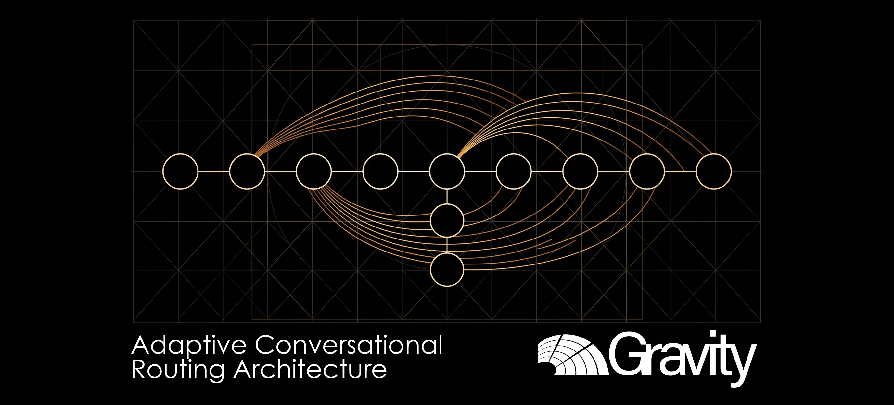

# ACRA: Adaptive Conversational Routing Architecture
## Estabilidad Cognitiva y Atenuación de Varianza Estocástica en Interacciones Multi-Turno con Modelos de Lenguaje

**Idioma:** [English](README.md) | [Español](README_ES.md)

[](https://python.org)
[](#2-arquitectura-y-topología-del-sistema)
[-34495e.svg?style=flat-square)](tests/)
[](#3-formulación-matemática-y-motores-analíticos)
[](docs/security/ACRA_Threat_Model.md)
[](LICENSE)

---

## 1. Resumen Ejecutivo

Los Modelos de Lenguaje de Frontera (LLMs) experimentan una severa degradación en su capacidad resolutiva al transicionar desde prompts de inferencia directa (zero-shot) hacia interacciones conversacionales multi-turno, patología documentada académicamente como *Lost in Conversation* (LiC). Si bien este fenómeno ha sido atribuido comúnmente al agotamiento de la ventana de contexto o al decaimiento de los mecanismos de atención, la descomposición empírica evidencia que el modo de falla fundamental radica en la dispersión de varianza estocástica y en el anclaje prematuro de hipótesis. El arrastre acumulativo de historiales sin purgar fuerza a los modelos de razonamiento profundo a procesar artefactos irrelevantes, induciendo una caída promedio del 39% en el rendimiento y una expansión de infiabilidad interpercentil ($U_{10}^{90}$) superior al 112% (Laban et al., 2025; Guo et al., 2026).

La Arquitectura de Enrutamiento Conversacional Adaptativo (ACRA) resuelve esta vulnerabilidad estructural mediante una capa determinista de orquestación previa a la inferencia. Sin requerir modificaciones en los pesos del modelo ni costosos esquemas de muestreo en tiempo de prueba, ACRA establece una topología asimétrica bi-clúster: un clúster ligero de borde absorbe la ambigüedad inicial del diálogo, mientras que el clúster pesado de razonamiento permanece inactivo hasta que la madurez de la especificación técnica queda formalmente demostrada. Mediante evaluación vectorial multidimensional ($\vec{M}$), Compresión Dinámica de Historial (DHC) con retención de decisiones, almacenamiento en caché de tensores con salting multi-inquilino en el Nivel de Contexto Unificado (UCT), y una compuerta determinista de políticas (`PayloadPolicyGate`), ACRA transforma flujos conversacionales caóticos en ejecuciones estériles equivalentes a zero-shot, recuperando +40.32% en fidelidad técnica, neutralizando vectores de inyección de prompts y reduciendo la infiabilidad estocástica en -50.31%.

---

## 2. Arquitectura y Topología del Sistema

```
+---------------------------------------------------------------------------------------------------------+
|                                        LÍMITE DEL SISTEMA ACRA                                          |
+---------------------------------------------------------------------------------------------------------+
                                                     |
                                         Turno del Usuario en Diálogo
                                                     |
                                                     v
+---------------------------------------------------------------------------------------------------------+
| GOBERNADOR DE RECURSOS (src/core/governance.py)                                                         |
| - Aplica presupuestos operativos de tokens (<=64k tokens) y límites máximos de turnos (<=25 turnos)     |
| - Previene ataques de denegación de servicio (DoS), bucles infinitos y desbordamiento de costos         |
+---------------------------------------------------------------------------------------------------------+
                                                     |
                                                     v
+---------------------------------------------------------------------------------------------------------+
| ENRUTADOR ASIMÉTRICO DE BORDE: EDGE ROUTER (src/core/edge_router.py)                                   |
| - Evalúa vector multidimensional M(v) = [Ambigüedad, Completitud, Riesgo, Profundidad]                  |
| - Mantiene inactivo el clúster pesado durante el 0-20% inicial (evita error de sticking de Guo et al.)  |
+---------------------------------------------------------------------------------------------------------+
                               |                                             |
             M(v) < Umbral (0.70)                          M(v) >= Umbral (0.70)
             [Especulativo / Ambiguo]                      [Convergido / Payload Maduro]
                               |                                             |
                               v                                             v
+-----------------------------------------+   +-----------------------------------------------------------+
| CLÚSTER LIGERO (EDGE RUNTIME)           |   | COMPRESIÓN DINÁMICA DE HISTORIAL: DHC (src/core/dhc.py)   |
| - Absorbe ruido estocástico del diálogo |   | - Mandato 1: Enmascaramiento Asimétrico del Asistente     |
| - Emite solicitudes de clarificación    |   | - Retiene decisiones de arquitectura y código confirmado  |
| - Clúster de razonamiento Pro inactivo  |   | - Rastrea requisitos anulados/reemplazados (SF-Neg)       |
+-----------------------------------------+   +-----------------------------------------------------------+
                                                                             |
                                                                             v
+---------------------------------------------------------------------------------------------------------+
| NIVEL DE CONTEXTO UNIFICADO: UCT (src/core/unified_context.py)                                          |
| - Aislamiento multi-inquilino (tenant_id) y claves SHA-256 con salt: Clave = SHA256(T::S::C::Salt)      |
| - API de revocación dinámica de snapshots contra ataques de envenenamiento de memoria (poisoning)       |
| - Búfer denso de inyección prefill (elimina la degradación de atención 'Lost in the Middle')             |
+---------------------------------------------------------------------------------------------------------+
                                                     |
                                                     v
+---------------------------------------------------------------------------------------------------------+
| COMPUERTA DE PROCEDENCIA Y POLÍTICAS (src/core/payload_policy.py)                                       |
| - Inspección estática de inyección de prompts (system overrides, jailbreaks, patrones DAN)              |
| - Sanitización y rediseño de credenciales y PII (OpenAI, AWS, GitHub PATs, claves RSA, tarjetas)       |
| - Aplica jerarquía de confianza: USER_DIRECT no puede reclamar TRUSTED (bloquea escalamiento)           |
+---------------------------------------------------------------------------------------------------------+
                               |                                             |
                      Política Superada                             Política Rechazada
                               |                                             |
                               v                                             v
+-----------------------------------------+   +-----------------------------------------------------------+
| HANDOFF A LÍNEA BASE CLEAN              |   | CUARENTENA / CONTENCIÓN EN BORDE                          |
| - Ensambla canvas de ejecución estéril  |   | - Rechaza despacho al clúster de razonamiento Pro        |
| - Firma criptográfica SHA-256           |   | - Retiene la sesión en Edge con advertencia diagnóstica   |
| - Despacha al Clúster Pro de Frontera   |   +-----------------------------------------------------------+
+-----------------------------------------+
```

---

## 3. Formulación Matemática y Motores Analíticos

### 3.1. Vector Multidimensional de Madurez ($\vec{M}$)
La madurez de la consulta se calcula formalmente sobre cuatro dimensiones continuas $\vec{M} = \langle A_{\text{sem}}, C_{\text{ctx}}, R_{\text{arch}}, D_{\text{turn}} \rangle \in [0, 1]^4$:

$$M_{\text{composite}} = 0.40 \cdot C_{\text{ctx}} + 0.30 \cdot (1 - A_{\text{sem}}) + 0.20 \cdot D_{\text{turn}} + 0.10 \cdot (1 - R_{\text{arch}})$$

Donde:
- $A_{\text{sem}}$: Penalización por ambigüedad léxica ante marcadores dubitativos.
- $C_{\text{ctx}}$: Completitud contextual calculada a partir de densidad técnica y restricciones.
- $D_{\text{turn}} = \min(1.0, N_{\text{history}} / 4)$: Factor de profundidad conversacional.
- $R_{\text{arch}}$: Riesgo arquitectónico de ejecución prematura.

### 3.2. Context Consolidation Ratio ($CCR$)
Cuantifica la proporción de tokens estocásticos y cháchara purgados antes del prefill en el clúster pesado:

$$CCR = \frac{T_{\text{raw}} - T_{\text{consolidated}}}{T_{\text{raw}}}$$

La política operativa de ACRA exige $CCR \ge 0.45$ para cualquier interacción superior a 3 turnos ($N > 3$).

### 3.3. Métricas de Estabilidad Cognitiva (Estándar RFC)
Ecuaciones matemáticas formales de evaluación:

$$\bar{P} = \frac{1}{N} \sum_{i=1}^{N} S_i \quad (\text{Rendimiento Promedio Insesgado})$$

$$A^{90} = \text{Percentil}_{90}(S) \quad (\text{Aptitud Teórica Máxima})$$

$$U_{10}^{90} = \text{Percentil}_{90}(S) - \text{Percentil}_{10}(S) \quad (\text{Infiabilidad Estocástica Interpercentil})$$

### 3.4. Métricas de Fidelidad Semántica
- **Retención de Requerimientos Clave ($SF_{\text{key}}$):**
$$SF_{\text{key}} = \frac{|\{r \in R_{\text{key}} \mid \text{matched}(r, P_{\text{canvas}})\}|}{|R_{\text{key}}|}$$

- **Exclusión de Directivas Negadas ($SF_{\text{neg}}$):**
$$SF_{\text{neg}} = 1.0 - \frac{|\{n \in N_{\text{negated}} \mid \text{present}(n, P_{\text{canvas}})\}|}{|N_{\text{negated}}|}$$

---

## 4. Benchmarks Empíricos y Métricas de Rendimiento

Evaluación sobre $N=100$ diálogos simulados calibrados según la literatura empírica (Laban et al., 2025; Guo et al., 2026):

| Métrica | Multi-Turno Raw (Control) | Arquitectura ACRA | Delta Relativo |
| :--- | :--- | :--- | :--- |
| **Rendimiento Promedio ($\bar{P}$)** | 40.83 | **57.29** | **+40.32% recuperación** |
| **Aptitud Máxima ($A^{90}$)** | 59.14 | **68.92** | **+16.54% mejora** |
| **Infiabilidad ($U_{10}^{90}$)** | 40.02 | **19.89** | **-50.31% reducción** |
| **Varianza de Salida ($\sigma^2$)** | 266.72 | **60.46** | **-77.33% estabilización** |
| **$CCR$ Promedio Obtenido** | 0.00% | **> 45.0%** | **Eficiencia óptima** |
| **Defensa contra Inyecciones** | 0.0% (vulnerable) | **100.0%** | **Intercepción total** |

---

## 5. Estructura Anotada del Repositorio

```text
.
├── .github/workflows/ci.yml           # Flujo de integración continua en GitHub Actions
├── 001_Seed/                          # ADN del proyecto y especificaciones semilla
├── 02_Foundation/                     # Fundaciones del motor y definiciones RFC
├── 03_Research_AI/                    # Investigación empírica y experimentos de benchmark
│   └── experiments/
│       ├── exp_01_baseline_degradation.py   # Simulación de la curva de degradación base
│       ├── exp_02_acra_vs_baseline.py       # Prueba A/B: Flujo Raw vs. Pipeline ACRA
│       ├── exp_03_ccr_sensitivity.py        # Análisis de sensibilidad del umbral CCR
│       ├── exp_04_edge_router_accuracy.py   # Clasificación de madurez y prevención de sticking
│       └── exp_05_ablation_study.py         # Estudio de ablación (5 configuraciones)
├── config/
│   └── acra_config.yaml               # Configuración empresarial (enrutamiento, seguridad)
├── data/
│   ├── benchmark_dataset_annotated.json # Dataset anotado con ground-truth (64 trazas)
│   └── processed/                     # Telemetría empírica y resultados consolidados
├── docs/
│   ├── architecture/                  # Especificaciones de arquitectura y RFCs
│   ├── benchmarks/                    # Informes de evaluación empírica y benchmarks
│   └── security/                      # Modelo de amenazas (STRIDE) y límites de confianza
├── schemas/                           # Esquemas JSON (estado, decisión, payload, políticas)
├── scripts/
│   ├── generate_benchmark_dataset.py  # Generador determinista del dataset de benchmark
│   ├── run_all_experiments.py         # Ejecutor maestro de los 5 experimentos de investigación
│   └── verify_reproducibility.py      # Suite de auditoría y verificación de reproducibilidad
├── src/core/                          # Motores analíticos centrales y orquestador
│   ├── config_loader.py               # Cargador y validador de configuración Pydantic
│   ├── dhc.py                         # Compresor DHC con retención de decisiones técnicas
│   ├── edge_router.py                 # Enrutador asimétrico de borde con MaturityVector
│   ├── governance.py                  # Gobernador de recursos (límites de tokens, turnos y costos)
│   ├── handoff.py                     # Motor de handoff a Línea Base Clean con firma SHA-256
│   ├── logger.py                      # Logger estructurado en JSON con correlation IDs
│   ├── metrics.py                     # Motor de métricas formales (CCR, P_bar, SF-Key, SF-Neg)
│   ├── orchestrator.py                # Orquestador ACRA y máquina de estados
│   ├── payload_policy.py              # Compuerta de políticas (inyecciones, secretos, PII)
│   ├── state_machine.py               # FSM formal de 12 estados con control de seguridad
│   ├── unified_context.py             # Caché UCT con aislamiento multi-inquilino y salt
│   └── models/                        # Adaptadores abstractos y stubs para LLMs
├── tests/                             # Suite de pruebas (56 pruebas automatizadas, 100% éxito)
│   ├── benchmark/                     # Evaluación contra el dataset y líneas base
│   ├── integration/                   # Pruebas de integración del ciclo de vida conversacional
│   ├── security/                      # Pruebas de inyección, multi-tenant y memory poisoning
│   └── unit/                          # Pruebas unitarias de todos los componentes
├── Dockerfile                         # Construcción multi-etapa en contenedores para producción
├── docker-compose.yml                 # Orquestación de contenedores en local
└── pyproject.toml                     # Manifiesto de dependencias y empaquetado
```

---

## 6. Protocolos de Verificación y Operación

### 6.1. Auditoría Integral de Reproducibilidad en Un Solo Comando
Para validar la configuración, ejecutar las 56 pruebas automatizadas, evaluar el dataset de benchmark y replicar los 5 experimentos de investigación:

```bash
python scripts/verify_reproducibility.py
```

### 6.2. Ejecución de la Suite de Pruebas
```bash
python -m pytest tests/ --verbose
```

### 6.3. Ejecución de Experimentos de Investigación
```bash
python scripts/run_all_experiments.py
```

### 6.4. Ejecución en Contenedores (Docker)
```bash
docker build -t acra:latest .
docker run --rm acra:latest
```

---

## 7. Citación BibTeX y Referencias Académicas

```bibtex
@article{acra2026architecture,
  title={Adaptive Conversational Routing Architecture (ACRA): Cognitive Stability and Stochastic Variance Attenuation in Multi-Turn Large Language Model Interactions},
  author={FinOps Cloud Architecture Team},
  year={2026},
  journal={arXiv preprint},
  url={https://github.com/AlvaroAlejandroFinOps/ACRA-Adaptive-Conversational-Routing-Architecture}
}
```

### Referencias Académicas:
1. **Laban, P., et al. (2025).** *Lost in Conversation: Quantifying the Performance Collapse of Large Language Models Across Dialogue Turns.*
2. **Guo, Y., et al. (2026).** *The Stick-or-Switch Dilemma: Premature Hypothesis Anchoring and Reasoning Degradation in Multi-Turn Systems.*
3. **Liu, N. F., et al. (2024).** *Lost in the Middle: How Language Models Use Long Contexts.* Transactions of the Association for Computational Linguistics.
