# METRICSTHINKING™: Auditoría Forense y Madurez del Proyecto

> **Motor Evaluador:** MetricsThinking™ v1.0.0-ENTERPRISE  
> **Proyecto Auditado:** `ACRA-Adaptive Conversational Routing Architecture`  
> **Ubicación:** `D:\0001 HyperScale Thinking\PROYECTOS CLOUD\Research and Development\ACRA-Adaptive Conversational Routing Architecture`  
> **Fecha de Auditoría:** `2026-09-22 21:21:14`  
> **Auditor Responsable:** `MetricsThinking™ Universal Auditor`  
> **Perfil Aplicado:** `default`  
> **Git Commit / Branch:** `b66ce38` / `master`  
> **Score Consolidado:** **`76.7% / 100.0%`**  
> **Banda de Madurez:** **Madurez Avanzada / Pre-producción (75.0% - 89.9%)**

---

## 1. RESUMEN EJECUTIVO Y GROUND TRUTH

MetricsThinking™ ha completado la auditoría forense estricta basada en evidencias físicas verificables en el repositorio.

- **Nota Global Consolidada ($Score_{Total}$):** **`76.67%`**
- **Criterios Cumplidos:** **`24 / 31`** (77.4%)
- **Cuello de Botella Inmediato:** **`M03: Gobernanza y Cumplimiento (66.7% completado)`**
- **Archivos Físicos Escaneados:** **`200`**
- **Memoria Técnica (Seed):** `Presente`
- **Gobernanza iDirectory (.context.yaml):** `Activa`

---

## 2. DASHBOARD EJECUTIVO DE MADUREZ POR MÓDULOS CANÓNICOS

| ID | Nombre del Módulo | Peso ($W_i$) | Criterios Cumplidos | % Cumplimiento | Contribución ($S_i$) | Estado |
|:---|:---|:---:|:---:|:---:|:---:|:---:|
| **M01** | Descubrimiento y Alcance | **5%** | `3 / 3` | **100.0%** | **5.00%** | 🟢 Done |
| **M02** | Arquitectura y Diseño Técnico | **10%** | `4 / 4` | **100.0%** | **10.00%** | 🟢 Done |
| **M03** | Gobernanza y Cumplimiento | **5%** | `2 / 3` | **66.7%** | **3.33%** | 🔵 Active |
| **M04** | Aprovisionamiento y Readiness | **5%** | `3 / 3` | **100.0%** | **5.00%** | 🟢 Done |
| **M05** | Construcción Núcleo (Core Engine) | **25%** | `4 / 4` | **100.0%** | **25.00%** | 🟢 Done |
| **M06** | Integración e Interoperabilidad | **15%** | `1 / 3` | **33.3%** | **5.00%** | 🔵 Active |
| **M07** | Aseguramiento de Calidad (QA & Stress) | **10%** | `3 / 3` | **100.0%** | **10.00%** | 🟢 Done |
| **M08** | Validación y Aceptación Organizacional | **10%** | `0 / 3` | **0.0%** | **0.00%** | ⚪ Backlog |
| **M09** | Despliegue y Automatización (CI/CD) | **10%** | `2 / 2` | **100.0%** | **10.00%** | 🟢 Done |
| **M10** | Cierre, Extensibilidad y Documentación | **5%** | `2 / 3` | **66.7%** | **3.33%** | 🔵 Active |
| **TOTAL** | **Ciclo de Vida Completo (SDD)** | **100%** | `24 / 31` | — | **`76.67%`** | **ADVANCED_MATURITY** |

---

## 3. ROADMAP VISUAL DE MADUREZ (MERMAID LR OPTIMIZADO)

Visualización de alta legibilidad en IDE con flujo horizontal continuo y codificación semántica de colores:

```mermaid
flowchart LR
    M01["<b>M01: Descubrimiento y Alcance</b><br/>100.0% | Done"]
    M02["<b>M02: Arquitectura y Diseño Técnico</b><br/>100.0% | Done"]
    M03["<b>M03: Gobernanza y Cumplimiento</b><br/>66.7% | Active"]
    M04["<b>M04: Aprovisionamiento y Readiness</b><br/>100.0% | Done"]
    M05["<b>M05: Construcción Núcleo (Core Engine)</b><br/>100.0% | Done"]
    M06["<b>M06: Integración e Interoperabilidad</b><br/>33.3% | Active"]
    M07["<b>M07: Aseguramiento de Calidad (QA & Stress)</b><br/>100.0% | Done"]
    M08["<b>M08: Validación y Aceptación Organizacional</b><br/>0.0% | Backlog"]
    M09["<b>M09: Despliegue y Automatización (CI/CD)</b><br/>100.0% | Done"]
    M10["<b>M10: Cierre, Extensibilidad y Documentación</b><br/>66.7% | Active"]

    M01 --> M02
    M02 --> M03
    M03 --> M04
    M04 --> M05
    M05 --> M06
    M06 --> M07
    M07 -.-> M08
    M08 --> M09
    M09 --> M10

    SUMMARY["<b>RESUMEN EJECUTIVO</b><br/>Score: 76.7% | ADVANCED_MATURITY<br/>Cuello de Botella: M03: Gobernanza y Cumplimiento"]
    M10 ==> SUMMARY

    %% Estilos semánticos
    classDef done fill:#1E4620,stroke:#2ECC71,stroke-width:2px,color:#FFFFFF;
    classDef active fill:#0D47A1,stroke:#2196F3,stroke-width:3px,color:#FFFFFF;
    classDef backlog fill:#2C3E50,stroke:#7F8C8D,stroke-width:1px,stroke-dasharray: 4 4,color:#BDC3C7;
    classDef blocked fill:#641E16,stroke:#E74C3C,stroke-width:2px,color:#FFFFFF;
    classDef summary fill:#1A252F,stroke:#F39C12,stroke-width:2px,color:#F1C40F;

    class M01 done;
    class M02 done;
    class M03 active;
    class M04 done;
    class M05 done;
    class M06 active;
    class M07 done;
    class M08 backlog;
    class M09 done;
    class M10 active;
    class SUMMARY summary;
```

**Leyenda Semántica:** `🟢 Verde (#1E4620 / #2ECC71)` = Done (100%) | `🔵 Azul (#0D47A1 / #2196F3)` = Active (1-99%) | `⚪ Gris (#2C3E50 / #7F8C8D)` = Backlog (0%) | `🔴 Rojo (#641E16 / #E74C3C)` = Blocked

---

## 4. DESGLOSE FORENSE DE EVIDENCIAS POR MÓDULO

### M01: Descubrimiento y Alcance — 🟢 DONE (100.0%)
**Peso Relativo:** 5% | **Contribución Ponderada:** 5.00%

| Criterio | Nombre | Estado | Evidencia Física Detectada |
|:---|:---|:---:|:---|
| `M01-C01` | Problem Statement Formalizado | ✅ `[CUMPLIDO]` | **`01_seed/seed-acra-adaptive-conversational-routing-architecture-master.md`** — Problem statement formalizado en '01_seed/seed-acra-adaptive-conversational-routing-architecture-master.md'. |
| `M01-C02` | Límites y Scope Declarados | ✅ `[CUMPLIDO]` | **`01_seed/seed-acra-adaptive-conversational-routing-architecture-master.md`** — Límites de alcance y fronteras del sistema identificados en '01_seed/seed-acra-adaptive-conversational-routing-architecture-master.md'. |
| `M01-C03` | Casos de Uso Formales | ✅ `[CUMPLIDO]` | **`01_seed/seed-acra-adaptive-conversational-routing-architecture-master.md`** — Perfiles de uso y casos definidos en '01_seed/seed-acra-adaptive-conversational-routing-architecture-master.md'. |

### M02: Arquitectura y Diseño Técnico — 🟢 DONE (100.0%)
**Peso Relativo:** 10% | **Contribución Ponderada:** 10.00%

| Criterio | Nombre | Estado | Evidencia Física Detectada |
|:---|:---|:---:|:---|
| `M02-C01` | AST / Modelos Canónicos Desacoplados | ✅ `[CUMPLIDO]` | **`src/core/models/llm_adapter.py`** — Modelos de dominio canónicos detectados en 3 archivos (e.g. 'src/core/models/llm_adapter.py'). |
| `M02-C02` | ADRs Documentados | ✅ `[CUMPLIDO]` | **`docs/architecture/ADR-001-cea-integration.md`** — Decisiones arquitectónicas formales identificadas (4 archivos, e.g. 'docs/architecture/ADR-001-cea-integration.md'). |
| `M02-C03` | Contratos JSON Schema Validados | ✅ `[CUMPLIDO]` | **`schemas/agent_definition.schema.json`** — Contratos formales de datos / esquemas presentes (10 esquemas, e.g. 'schemas/agent_definition.schema.json'). |
| `M02-C04` | Topología y Grafos Formales | ✅ `[CUMPLIDO]` | **`.context/tree.json`** — Mapa topológico satelital y grafo formal del proyecto activo en '.context/tree.json'. |

### M03: Gobernanza y Cumplimiento — 🔵 ACTIVE (66.7%)
**Peso Relativo:** 5% | **Contribución Ponderada:** 3.33%

| Criterio | Nombre | Estado | Evidencia Física Detectada |
|:---|:---|:---:|:---|
| `M03-C01` | Detección y Marcado de PII | ✅ `[CUMPLIDO]` | **`src/core/security/concurrency_control.py`** — Mecanismos de privacidad o marcado PII detectados en 'src/core/security/concurrency_control.py'. |
| `M03-C02` | Reglas de Calidad Formales (cQS) | ❌ `[FALTANTE]` | No se encontraron reglas cuantitativas de calidad formal (cQS). |
| `M03-C03` | Validación Estricta de Esquemas / Context | ✅ `[CUMPLIDO]` | **`.context/tree.json`** — Gobernanza contextual iDirectory activa con 25 archivos de contexto (.context.yaml). |

### M04: Aprovisionamiento y Readiness — 🟢 DONE (100.0%)
**Peso Relativo:** 5% | **Contribución Ponderada:** 5.00%

| Criterio | Nombre | Estado | Evidencia Física Detectada |
|:---|:---|:---:|:---|
| `M04-C01` | Entorno Reproducible | ✅ `[CUMPLIDO]` | **`pyproject.toml`** — Manifiesto de empaquetado y entorno reproducible verificado en 'pyproject.toml'. |
| `M04-C02` | Dependencias Versionadas | ✅ `[CUMPLIDO]` | **`pyproject.toml`** — Especificación estricta de versiones de dependencias verificada en 'pyproject.toml'. |
| `M04-C03` | Fixture Enterprise Disponible | ✅ `[CUMPLIDO]` | **`data/processed/.context.yaml`** — Fixtures y datos de prueba disponibles (5 archivos, e.g. 'data/processed/.context.yaml'). |

### M05: Construcción Núcleo (Core Engine) — 🟢 DONE (100.0%)
**Peso Relativo:** 25% | **Contribución Ponderada:** 25.00%

| Criterio | Nombre | Estado | Evidencia Física Detectada |
|:---|:---|:---:|:---|
| `M05-C01` | Parsers Funcionales | ✅ `[CUMPLIDO]` | **`src/core/config_loader.py`** — Módulos de parseo e ingesta identificados en 'src/core/config_loader.py'. |
| `M05-C02` | Inferencia Operativa de Roles | ✅ `[CUMPLIDO]` | **`src/core/config_loader.py`** — Motor nuclear de procesamiento y lógica operativa verificado en 'src/core/config_loader.py'. |
| `M05-C03` | Resolución de Relaciones y Ciclos | ✅ `[CUMPLIDO]` | **`src/core/agents/lifecycle.py`** — Resolución de relaciones y dependencias verificado en 'src/core/agents/lifecycle.py'. |
| `M05-C04` | Generador Canónico de Métricas / Lógica | ✅ `[CUMPLIDO]` | **`src/core/metrics.py`** — Mecanismo de generación de métricas o síntesis operativa detectado en 'src/core/metrics.py'. |

### M06: Integración e Interoperabilidad — 🔵 ACTIVE (33.3%)
**Peso Relativo:** 15% | **Contribución Ponderada:** 5.00%

| Criterio | Nombre | Estado | Evidencia Física Detectada |
|:---|:---|:---:|:---|
| `M06-C01` | Emisores de Dialecto Nativo | ❌ `[FALTANTE]` | No se encontraron emisores nativos de plataforma o destino. |
| `M06-C02` | Escritura Atómica y Safe-Encoding | ❌ `[FALTANTE]` | Falta estandarización de escritura atómica y safe-encoding UTF-8. |
| `M06-C03` | Exportación Multi-Formato | ✅ `[CUMPLIDO]` | Soporte de representación multi-formato verificado en el repositorio (.jpg, .json, .md, .py, .toml). |

### M07: Aseguramiento de Calidad (QA & Stress) — 🟢 DONE (100.0%)
**Peso Relativo:** 10% | **Contribución Ponderada:** 10.00%

| Criterio | Nombre | Estado | Evidencia Física Detectada |
|:---|:---|:---:|:---|
| `M07-C01` | Cobertura y Tasa de Éxito de Pruebas | ✅ `[CUMPLIDO]` | **`tests/run_all_tests.py`** — Suite de pruebas presente (30 archivos de prueba en tests/, e.g. 'tests/run_all_tests.py'). |
| `M07-C02` | Golden Regression Tests Validados | ✅ `[CUMPLIDO]` | **`03_research/experiments/exp_01_baseline_degradation.py`** — Pruebas de regresión deterministas (Golden files/Snapshots) identificadas en '03_research/experiments/exp_01_baseline_degradation.py'. |
| `M07-C03` | Suites de Estrés / Benchmark Masivo | ✅ `[CUMPLIDO]` | **`tests/benchmark/test_benchmark_dataset.py`** — Suites de estrés o benchmarks masivos verificados en 'tests/benchmark/test_benchmark_dataset.py'. |

### M08: Validación y Aceptación Organizacional — ⚪ BACKLOG (0.0%)
**Peso Relativo:** 10% | **Contribución Ponderada:** 0.00%

| Criterio | Nombre | Estado | Evidencia Física Detectada |
|:---|:---|:---:|:---|
| `M08-C01` | Proyecciones por Rol (Persona Lenses) | ❌ `[FALTANTE]` | No se encontraron proyecciones adaptadas por rol organizativo. |
| `M08-C02` | Leadership Cockpit / Tableros Ejecutivos | ❌ `[FALTANTE]` | No se encontró cockpit ejecutivo ni módulos de dashboards en src/dashboards/. |
| `M08-C03` | CLI de Diagnóstico y Exploración | ❌ `[FALTANTE]` | No se detectó interfaz CLI ni punto de entrada interactivo en consola. |

### M09: Despliegue y Automatización (CI/CD) — 🟢 DONE (100.0%)
**Peso Relativo:** 10% | **Contribución Ponderada:** 10.00%

| Criterio | Nombre | Estado | Evidencia Física Detectada |
|:---|:---|:---:|:---|
| `M09-C01` | Pipeline CI/CD Automatizado | ✅ `[CUMPLIDO]` | **`.github/workflows/ci.yml`** — Pipeline de integración continua automatizado verificado en '.github/workflows/ci.yml'. |
| `M09-C02` | Empaquetado y Distribución Estandarizada | ✅ `[CUMPLIDO]` | **`pyproject.toml`** — Configuración de empaquetado estándar/entry points verificada en 'pyproject.toml'. |

### M10: Cierre, Extensibilidad y Documentación — 🔵 ACTIVE (66.7%)
**Peso Relativo:** 5% | **Contribución Ponderada:** 3.33%

| Criterio | Nombre | Estado | Evidencia Física Detectada |
|:---|:---|:---:|:---|
| `M10-C01` | Documentación Técnica Exhaustiva (Seed) | ✅ `[CUMPLIDO]` | **`01_seed/seed-acra-adaptive-conversational-routing-architecture-master.md`** — Memoria técnica formal (ThinkingSeed) identificada en '01_seed/seed-acra-adaptive-conversational-routing-architecture-master.md'. |
| `M10-C02` | CLI Help Documentado | ❌ `[FALTANTE]` | Falta documentación detallada de CLI help o guía operativa de comandos. |
| `M10-C03` | Adaptadores Multicanal / Roadmap | ✅ `[CUMPLIDO]` | **`src/core/audit/cea_adapter.py`** — Interfaces de extensibilidad y adaptadores multicanal verificados en 'src/core/audit/cea_adapter.py'. |

---

## 5. PLAN DE REMEDIACIÓN TÉCNICA PRIORIZADO (PATH TO 100%)

A continuación se prescriben las acciones técnicas prioritarias para desbloquear el avance del proyecto y alcanzar la máxima calificación:

| Prioridad | Módulo | Criterio | Acción Requerida | Impacto Potencial | Archivos Sugeridos |
|:---:|:---:|:---|:---|:---:|:---|
| **P1** | `M03` | `M03-C02` | Implementar reglas de calidad de datos o código cQS. | **+1.67%** | `.context.yaml`, `schemas/` |
| **P2** | `M06` | `M06-C01` | Crear emisores hacia tecnologías destino en src/core/emitter o similar. | **+5.00%** | `src/core/emitter/` |
| **P2** | `M06` | `M06-C02` | Usar atomic write y UTF-8 seguro para serializar artefactos. | **+5.00%** | `src/core/emitter/` |
| **P2** | `M08` | `M08-C01` | Implementar proyecciones adaptadas a diferentes perfiles (lenses/personas). | **+3.33%** | `src/dashboards/`, `tools/` |
| **P2** | `M08` | `M08-C02` | Proveer dashboard o cockpit de resumen ejecutivo. | **+3.33%** | `src/dashboards/`, `tools/` |
| **P2** | `M08` | `M08-C03` | Exponer comandos CLI de diagnóstico o auditoría. | **+3.33%** | `src/dashboards/`, `tools/` |
| **P3** | `M10` | `M10-C02` | Documentar comandos CLI y opciones en README o help. | **+1.67%** | `01_seed/`, `docs/` |

---

> *Reporte generado automáticamente por **MetricsThinking™ Universal Project Auditor**.*  
> *Disciplina de auditoría: **Ground Truth First** (evidencia física sobre supuestos).*